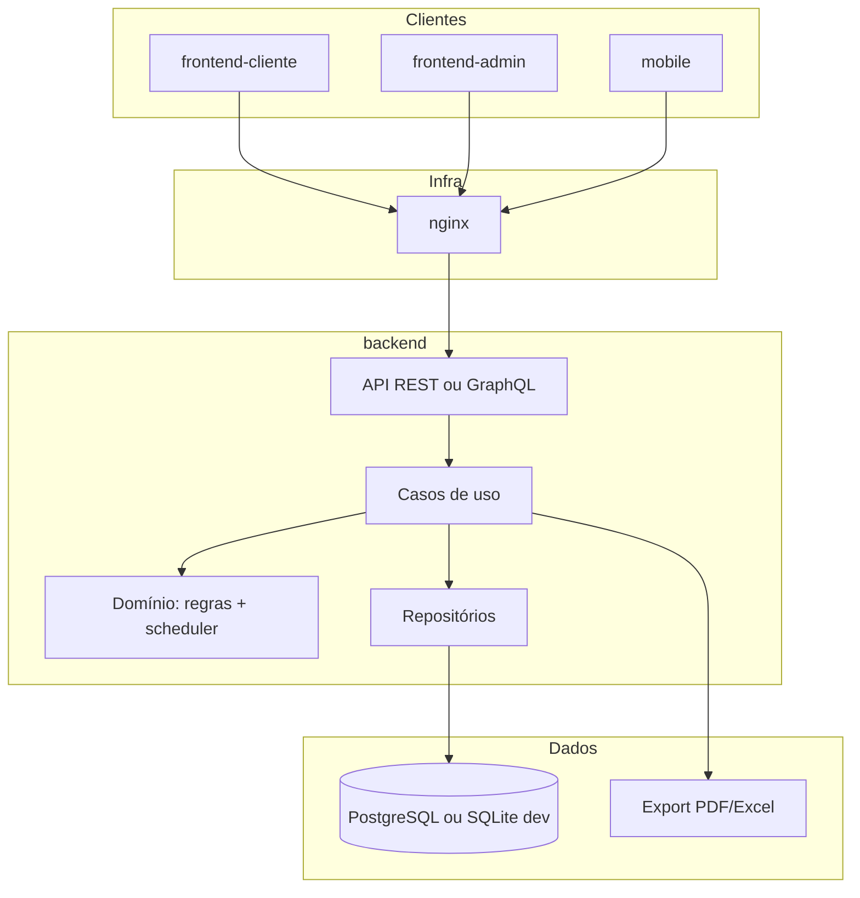

# Arquitetura alvo — Escala Piloto de Apoio v2

Documento de **planejamento**. Nenhum código de aplicação foi implementado nesta fase.  
Baseado na análise da v1 (`pilotodeapoio` V52).

---

## 1. Objetivos da v2

1. **Separar domínio da UI** — regras e geração testáveis sem Streamlit.  
2. **Multi-superfície** — cliente (piloto/gestor local), admin (configuração), mobile (consulta futura).  
3. **API estável** — backend expõe escala, geração, validação e exportação.  
4. **Paridade operacional** — mesmas siglas, cores e regras documentadas em `regras-extraidas-v1.md`.  
5. **Deploy reproduzível** — Docker + nginx; banco não preso ao perfil Windows do usuário.

---

## 2. Estrutura de repositório (fase 0 — criada)

```
pilotodeapoiov2/
├── docs/                    # Regras, arquitetura, decisões
├── backend/                 # API + domínio + persistência
├── frontend-cliente/        # Grade, geração, pré-alocações (operacional)
├── frontend-admin/          # Funcionários, turnos, restrições, auditoria
├── mobile/                  # Consulta (fase posterior)
└── infra/
    ├── docker/              # Compose, imagens
    └── nginx/               # Reverse proxy, TLS
```

---

## 3. Visão de camadas



### 3.1 Domínio (extrair da v1)

| Pacote v2 (sugestão) | Origem v1 |
|----------------------|-----------|
| `domain/rules` | `core/rules.py` |
| `domain/scheduler` | `scheduler_v2` + fatias estáveis de `scheduler.py` |
| `domain/t8` | `t8_planner.py` |
| `domain/coverage` | `coverage_gate.py` |
| `domain/validation/spreadsheet` | `spreadsheet_validator.py` |
| `domain/models` | `models.py` |

**Princípio:** zero import de Streamlit ou pandas na camada de regras puras (pandas opcional só em relatórios).

### 3.2 Aplicação (casos de uso)

| Caso de uso | Descrição |
|-------------|-----------|
| `GenerateMonthSchedule` | Pipeline unificado v1 (capacidade → turnos → cobertura → folgas → VOO) |
| `ValidateSchedule` | Executa as 22 regras; retorna lista estruturada |
| `ApplyPreAllocation` | FP, férias, simulador, etc. |
| `EditDay` | Equivalente a `apply_visual_day_change` + heal |
| `DeleteMonth` | Semântica de `delete_month_schedule` |
| `ExportVisual` | PDF/Excel com cores v1 |
| `DiagnoseCapacity` | `diagnose_capacity` |

### 3.3 Infraestrutura

- **nginx:** termina TLS, rate limit, roteamento `/api` e estáticos dos frontends.  
- **docker:** serviços `api`, `db`, `frontend-cliente`, `frontend-admin` (build multi-stage).  
- **Ambientes:** `dev` (SQLite ou Postgres local), `staging`, `prod`.

---

## 4. Fluxo mensal alvo (único)

Alinhado ao motor unificado da V52, simplificado para operadores:

```
┌─────────────────┐
│ Pré-alocações   │  férias, FP, simulador, curso, DM, restrições
└────────┬────────┘
         ▼
┌─────────────────┐
│ Diagnóstico     │  capacidade PAO/APAO (opcional mas recomendado)
└────────┬────────┘
         ▼
┌─────────────────┐
│ Gerar escala    │  turnos → cobertura 100% T6/T7/T8 → T8/ND → folgas → VOO
└────────┬────────┘
         ▼
┌─────────────────┐
│ Validar         │  22 regras + gaps planilha
└────────┬────────┘
         ▼
┌─────────────────┐
│ Escala visual   │  edição pontual + reparo + export
└─────────────────┘
```

Não expor na UI v2 um botão separado “Alocar folgas e voos” se o pipeline já os inclui — evita regressão da “dupla verdade” de fluxo.

---

## 5. Modelo de dados v2 (evolução do v1)

### 5.1 Manter conceitos

- **Assignment** — um turno (T1–T8) em um dia para um funcionário.  
- **Allocation** — um bloqueio/folga/atividade por funcionário/dia (UNIQUE por par).  
- **Shift restriction** — turno bloqueado no mês.

### 5.2 Melhorias recomendadas

| Problema v1 | Proposta v2 |
|-------------|-------------|
| `(Original: X)` em `notes` | Colunas `promoted_from`, `promotion_kind` (SOCIAL, AGRUPADA) |
| Dois motores | Um `ScheduleEngine` com estratégias plugáveis |
| Folga 10 vs 11–12 | Campo de política por competência ou config global |
| Cache Streamlit | Cache de aplicação (Redis) ou stateless API |

### 5.3 Migração de dados

1. Ler `escala.db` v1 do path configurável.  
2. Mapear tabelas 1:1 na primeira release.  
3. Script pós-migração: normalizar `notes` → campos estruturados onde possível.

---

## 6. Frontends

### 6.1 frontend-cliente

Público: gestão da escala do mês.

- Grade PAO / APAO separadas (paridade visual).  
- Pré-alocações, gerar, validar, exportar.  
- Edição por sigla (mesmo mapa `visual_code_to_action`).  
- Dashboard de capacidade e métricas (folgas 10, produtivos 20−ND).

**Stack sugerida:** React ou Vue + TypeScript; tema laranja `#ff7900` do v1.

### 6.2 frontend-admin

Público: RH / administrador do sistema.

- CRUD funcionários (senioridade, cargo, turno fixo, sem voo).  
- CRUD turnos (horários, no_fds, capacidade).  
- Restrições mensais por turno.  
- Backups, versão do schema, logs de geração.

### 6.3 mobile

Fase posterior: consulta read-only da própria escala + notificações (opcional).

---

## 7. Backend (esboço)

```
backend/
├── src/
│   ├── api/           # rotas HTTP, DTOs, auth
│   ├── application/   # casos de uso
│   ├── domain/        # regras portadas da v1
│   └── infrastructure/
│       ├── persistence/
│       └── export/    # PDF, Excel
├── tests/             # port de test_rules.py
└── pyproject.toml ou requirements.txt
```

**Auth (decisão pendente):** JWT + roles (`operador`, `admin`, `piloto`) — ver `decisoes-tecnicas.md`.

**Idioma do domínio:** manter termos operacionais em português (FOLGA SOCIAL, ND, PAO) nas APIs e enums.

---

## 8. Observabilidade e qualidade

- Cada geração persiste: `run_id`, parâmetros, violações encontradas, tentativas do auto-loop.  
- CI: `pytest` no domínio (sem UI); lint + type check.  
- Contrato: suite derivada de `tests/test_rules.py` da v1.

---

## 9. Fases de implementação sugeridas

| Fase | Entrega |
|------|---------|
| **0** (atual) | Docs + estrutura de pastas |
| **1** | Domínio puro portado + testes verdes |
| **2** | API + Postgres/SQLite + migração schema v1 |
| **3** | frontend-cliente (grade + gerar + validar) |
| **4** | Export PDF/Excel + admin CRUD |
| **5** | Docker/nginx + staging |
| **6** | Mobile (opcional) |

---

## 10. O que não fazer na v1→v2

- Reescrever regras de negócio sem testes de paridade.  
- Mudar siglas/cores sem alinhamento com operação.  
- Introduzir ND genérico para preencher buraco.  
- Manter Streamlit como shell principal da v2.

---

*Ver também: `regras-extraidas-v1.md`, `decisoes-tecnicas.md`.*
